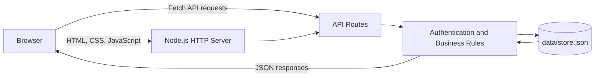

# SolarChain


SolarChain is a neighborhood-scale renewable energy marketplace and simulation platform. It demonstrates how households with solar panels can offer surplus electricity to nearby consumers, how local energy transactions can be managed, and how an administrator can supervise marketplace activity.

The project combines a responsive single-page interface, a Node.js HTTP server, role-based workflows, and persistent JSON storage in a compact application designed for demonstration and educational use.

## Project Purpose

Solar energy producers often generate more electricity than they consume during sunny hours. SolarChain models a local system in which this surplus can be listed, reviewed, and purchased by other residents in the same community.

The application focuses on three questions:

1. How much energy can a neighborhood produce and consume?
2. How can surplus energy become a marketplace listing?
3. How can buyers, producers, and administrators interact in the same system?

## Main Features

### Energy Marketplace

- Displays approved and active energy listings
- Shows producer, neighborhood, available energy, panel capacity, and unit price
- Simulates small live price movements
- Allows buyers to select an amount and purchase energy
- Updates buyer and producer balances after each transaction
- Creates a clean-energy certificate number for completed purchases

### Neighborhood Simulation

- Visualizes a neighborhood with producer and consumer households
- Provides controls for time, household count, panel capacity, sunlight, and demand
- Calculates estimated production, consumption, surplus energy, and carbon impact
- Converts simulated surplus energy directly into a marketplace listing

### Listing Management

- Allows producers to create new energy listings
- Validates energy amount and price on the server
- Keeps producer listings pending until administrator approval
- Displays listing status, remaining energy, neighborhood, and current price

### Wallet and Impact Tracking

- Shows the signed-in user's current balance
- Lists personal purchases and sales
- Displays transaction certificates
- Estimates avoided carbon emissions and local economic value

### Administration

- Restricts administrative actions to the manager role
- Lists pending marketplace submissions
- Allows listings to be approved or rejected
- Displays marketplace statistics and contact messages

### User Experience

- Uses client-side navigation without full-page reloads
- Supports desktop and mobile layouts
- Provides visible success and error notifications
- Includes prepared demo data for immediate testing

## User Roles

| Role | Main Capabilities |
| --- | --- |
| Buyer | Browse listings, purchase energy, and review wallet activity |
| Producer | Create listings manually or from the simulation and review listing status |
| Administrator | Approve or reject listings and monitor application activity |

## Demo Accounts

The repository includes demonstration accounts so every workflow can be tested immediately.

| Role | Email | Password |
| --- | --- | --- |
| Administrator | `admin@solarchain.local` | `admin123` |
| Producer | `uretici@solarchain.local` | `uretici123` |
| Buyer | `alici@solarchain.local` | `alici123` |

> These credentials are intentionally public and must only be used for local demonstration purposes.

## Technology Stack

| Layer | Technology | Responsibility |
| --- | --- | --- |
| Frontend | HTML5 | Application shell and semantic page structure |
| Styling | CSS3 | Responsive layout, components, neighborhood visualization, and animations |
| Client logic | Vanilla JavaScript | Routing, rendering, form handling, API requests, and user interaction |
| Backend | Node.js | HTTP server, authentication, validation, business rules, and static files |
| Persistence | JSON | Users, sessions, listings, trades, messages, and counters |

The application has no external runtime dependencies. The backend uses Node.js core modules such as `http`, `fs`, `path`, and `crypto`.

## Architecture



The browser loads one HTML shell and JavaScript renders the appropriate page according to the current URL. Internal links are intercepted with the History API, allowing page transitions without reloading the document.

When an operation changes data, the frontend sends a request to an API route. The server verifies the session and user role, applies the relevant business rules, updates `data/store.json`, and returns a JSON response.

## Project Structure

```text
solarchain/
├── data/
│   └── store.json          # Demo users, listings, trades, sessions, and messages
├── public/
│   ├── css/
│   │   └── style.css       # Complete responsive interface styling
│   ├── images/
│   │   ├── logo.png
│   │   └── logo.svg
│   └── js/
│       └── app.js          # SPA rendering, navigation, events, and API calls
├── views/
│   └── index.html          # Shared HTML application shell
├── server.js               # HTTP server, API routes, authentication, and data logic
├── package.json
└── README.md
```

## Getting Started

### Requirements

- Node.js 18 or newer
- A modern browser such as Chrome, Edge, Firefox, or Safari
- Git, if the repository will be cloned

### Installation

```bash
git clone https://github.com/ecalban/solarchain.git
cd solarchain
npm start
```

Open the following address after the server starts:

```text
http://127.0.0.1:3000
```

No database server or environment file is required for this version.

### Using a Different Port

If port `3000` is already in use, start the application with another port:

```bash
PORT=3001 npm start
```

Then open `http://127.0.0.1:3001`.

## Suggested Demo Flow

1. Open the home page and introduce the marketplace statistics.
2. Visit the simulation page and adjust sunlight, demand, and panel capacity.
3. Sign in with the producer account and create a listing from the simulation.
4. Sign out and enter the administrator account.
5. Approve the pending listing from the administration page.
6. Sign in with the buyer account and purchase energy from the marketplace.
7. Open the wallet to show the updated balance, transaction, impact, and certificate.

This flow demonstrates the complete lifecycle of an energy listing from production estimation to approval and purchase.

## API Overview

| Method | Endpoint | Purpose | Authentication |
| --- | --- | --- | --- |
| `GET` | `/api/state` | Returns marketplace data and summary statistics | Public |
| `GET` | `/api/session` | Returns the current signed-in user | Public |
| `POST` | `/api/login` | Creates a user session | Public |
| `POST` | `/api/logout` | Removes the current session | Signed-in user |
| `POST` | `/api/listings` | Creates an energy listing | Producer or administrator |
| `POST` | `/api/trades` | Purchases energy from an active listing | Buyer or administrator |
| `POST` | `/api/messages` | Saves a contact message | Public |
| `GET` | `/api/admin` | Returns administrative data | Administrator |
| `POST` | `/api/admin/listings/:id/approve` | Approves a pending listing | Administrator |
| `POST` | `/api/admin/listings/:id/reject` | Rejects a pending listing | Administrator |

## How Button Actions Are Connected

Interactive elements use `data-*` attributes rather than inline JavaScript. For example, a purchase button is rendered with a `data-buy` attribute:

```html
<button class="primary" data-buy="listing_id">Buy Energy</button>
```

The client script locates matching buttons and assigns the click handler:

```js
document.querySelectorAll("[data-buy]").forEach((button) => {
  button.onclick = async () => {
    // Validate input and call POST /api/trades
  };
});
```

This keeps the interface markup separate from application behavior and makes each interaction easier to trace.

## Data Storage

All application data is stored in `data/store.json`. The server reads this file before handling API operations and writes it after a successful change.

The file contains:

- User profiles and salted password hashes
- Active login sessions
- Energy listings and price history
- Completed energy transactions
- Clean-energy impact values
- Contact messages
- ID counters

Because the application writes directly to this file, running a demonstration changes the included data. Restore the file from Git to return to the original demo state:

```bash
git restore data/store.json
```

## Security and Production Notes

SolarChain is an educational prototype, not a production energy trading platform. A real deployment should include:

- PostgreSQL or another transactional database
- Environment-based secrets and configuration
- Strong adaptive password hashing such as Argon2 or bcrypt
- CSRF protection and stricter cookie settings
- Request rate limiting and security headers
- Server-side schema validation
- Expiring sessions and password recovery
- Automated tests, audit logs, and transaction locking
- Real smart-meter or energy-provider integrations

## Future Improvements

- Real-time updates through WebSockets
- Interactive map data and household positioning
- Historical price and production charts
- Automatic producer-to-consumer matching
- Notifications for approvals and purchases
- Downloadable energy certificates
- PostgreSQL persistence and database migrations
- Automated unit, API, and browser tests
- Deployment through Docker and a cloud platform

## License

This project is distributed under the MIT License as declared in `package.json`.
